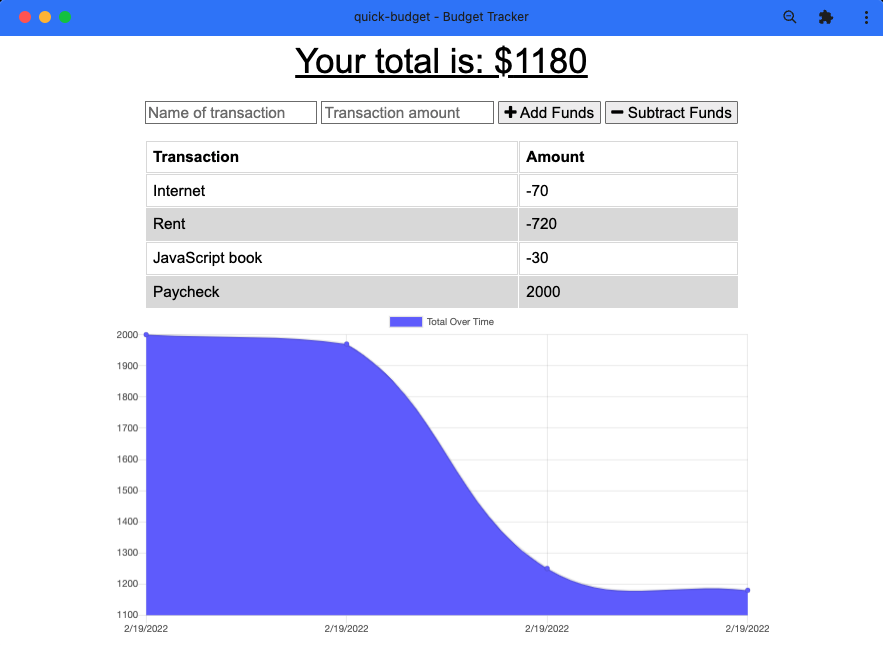

# Quick Budget
A simple budget tracker progressive web application. Enter transactions online, offline, or install the app to your computer or device.

Deployment: https://quick-budget2100.herokuapp.com/

## Table of Contents

- [Installation](#installation)
- [Usage](#usage)
- [License](#license)
- [Contributions](#contributions)
- [Technologies](#technologies)
- [Credits](#credits)
- [Questions](#questions)

## Installation

Use "npm install" to install required modules for this application. Click the icon to the right of the URL in your browser to download the application to your device. 

## Usage

Enter transactions to view a graph and a list of your income and expenses. To test out offline capability, go to developer tools, network, and select offline. To delete all data, go to developer tools, application, storage, and check IndexedDB and Cache Storage before clicking clear site data. 

## License

This project is licensed under the MIT license.

## Contributions

Fork the project and create a pull request. Let us know how you think you can contribute!

## Technologies

Created with Node.js, Express.js, MongoDB, and Mongoose. Deployed with Heroku and MongoDB Atlas.

## Credits

Created by Joshua Schermann

## Questions

Post an issue if you see a bug or suggested improvement.